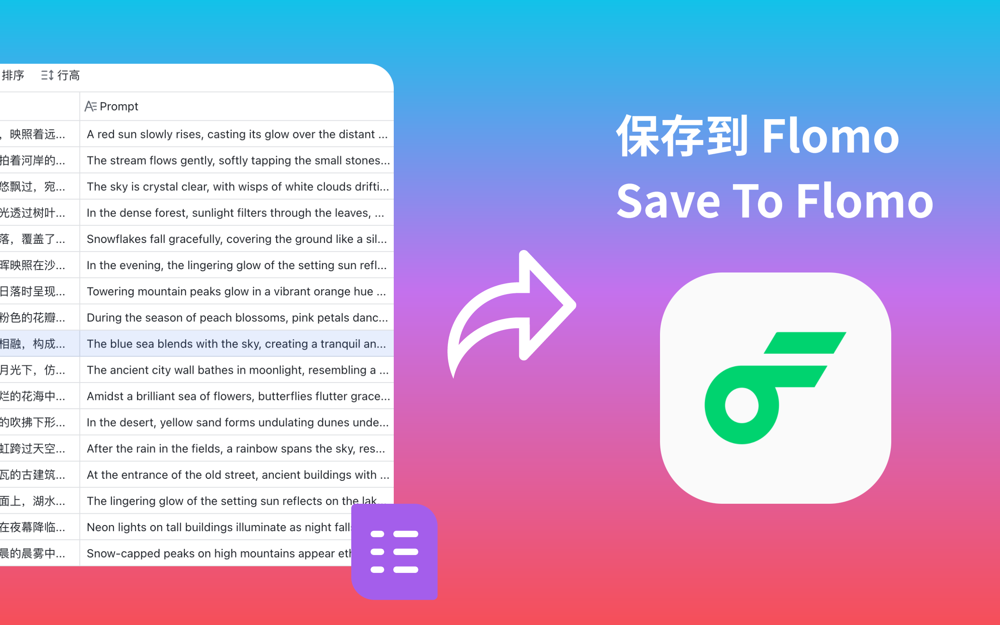

# 保存到 Cubox

## 功能描述

保存选中记录到 Cubox。

## 插件使用说明

使用 Cubox API，将表格中选中的记录保存到 Cubox 中。
- 从 Cubox 官网中获取 API 链接，填入设置中。
- 选中记录后，点击保存，即可保存到 Cubox。
- 可以设置收藏夹和标签。

## 插件模板

https://checkcai.feishu.cn/base/IZV6bXY6ya2SLpsXIMJcTPV3nIb?from=from_copylink
